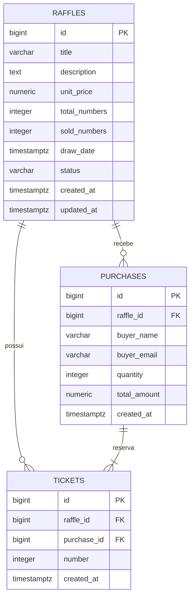

# Banco de Dados — Rifinha Digital (PostgreSQL)

Documento de projeto do banco de dados relacional da Rifinha Digital. Descreve
a modelagem, o DER, as entidades, os relacionamentos, chaves, constraints,
índices, a análise de normalização (até a 3FN) e as justificativas de todas as
decisões. O SQL correspondente está em `src/database/schema.sql` (esquema) e
`src/database/seed.sql` (dados de exemplo).

> Escopo: apenas o banco de dados. Regras de negócio de aplicação (fora do que o
> SGBD garante por constraints) não são tratadas aqui.

---

## Sumário

1. [Modelagem do banco](#1-modelagem-do-banco)
2. [DER (Mermaid)](#2-der-mermaid)
3. [Explicação das entidades](#3-explicação-das-entidades)
4. [Relacionamentos e cardinalidades](#4-relacionamentos-e-cardinalidades)
5. [Chaves primárias e estrangeiras](#5-chaves-primárias-e-estrangeiras)
6. [Constraints](#6-constraints)
7. [Índices recomendados](#7-índices-recomendados)
8. [Normalização (até 3FN)](#8-normalização-até-3fn)
9. [Scripts SQL completos](#9-scripts-sql-completos)
10. [Justificativa das decisões](#10-justificativa-das-decisões)

---

## 1. Modelagem do banco

O domínio é modelado em **três tabelas**:

| Tabela | Representa | Grão (uma linha =) |
|---|---|---|
| `raffles` | As rifas | uma rifa |
| `purchases` | As compras realizadas | uma compra (um "pedido") |
| `tickets` | As cotas/números vendidos | **um único número** de uma rifa |

A decisão central da modelagem é representar **cada número vendido como uma
linha** em `tickets` (e não como um array/coluna dentro da compra). Isso permite
ao próprio banco impor, via `UNIQUE (raffle_id, number)`, que um número **nunca**
seja vendido duas vezes na mesma rifa — a regra de negócio mais crítica do
sistema — de forma atômica e à prova de concorrência.

A coluna `raffles.sold_numbers` é um **dado derivado** (contagem de tickets da
rifa), mantido de forma desnormalizada e controlada. A justificativa e os
trade-offs estão nas seções 8 e 10.

---

## 2. DER (Mermaid)



> Notação (crow's foot): `||` = um (e apenas um); `o{` = zero ou muitos;
> `|{` = um ou muitos.

---

## 3. Explicação das entidades

### `raffles` (Rifa)
Entidade principal. Guarda os dados descritivos e o estado de cada rifa.
- `title`, `description` — identificação e detalhamento.
- `unit_price` — valor por número (`NUMERIC` para precisão monetária exata).
- `total_numbers` — quantidade total de números da rifa.
- `sold_numbers` — quantidade já vendida (derivado; ver seção 8).
- `draw_date` — data do sorteio / data-limite.
- `status` — `DISPONIVEL` ou `ENCERRADA`. Uma rifa encerra quando todos os
  números são vendidos **ou** a data-limite é atingida (transição controlada
  pela aplicação; o SGBD apenas restringe os valores válidos).
- `created_at` / `updated_at` — auditoria temporal.

### `purchases` (Compra)
Representa o ato de compra — o "cabeçalho" do pedido feito por um comprador.
- `raffle_id` — a rifa à qual a compra pertence.
- `buyer_name`, `buyer_email` — identificação do comprador. (Não há tabela de
  usuários porque o sistema não possui autenticação — ver seção 10.)
- `quantity` — quantidade de números comprados (igual ao nº de tickets da compra).
- `total_amount` — valor total pago (`quantity × unit_price` no momento da compra).
- `created_at` — quando a compra ocorreu.

### `tickets` (Cota / Número)
A tabela de maior granularidade: **uma linha por número vendido**. É a "tabela
associativa" que materializa os números reservados e concentra a garantia de
unicidade.
- `raffle_id` — a rifa do número (redundante com a da compra, por design — ver
  seção 10).
- `purchase_id` — a compra que reservou este número.
- `number` — o número da cota em si.

---

## 4. Relacionamentos e cardinalidades

| Relacionamento | Cardinalidade | Leitura |
|---|---|---|
| `raffles` → `purchases` | **1 : N** (um para muitos) | Uma rifa recebe zero ou muitas compras; cada compra pertence a exatamente uma rifa. |
| `purchases` → `tickets` | **1 : N** (um para muitos, ≥ 1) | Uma compra reserva **um ou mais** números; cada ticket pertence a exatamente uma compra. |
| `raffles` → `tickets` | **1 : N** (um para muitos) | Uma rifa possui zero ou muitos tickets vendidos; cada ticket pertence a uma rifa. |

Conceitualmente, `tickets` resolve o relacionamento **N:N entre "compras" e "os
números possíveis de uma rifa"**: cada número só pode estar em uma compra, e o
`UNIQUE (raffle_id, number)` impede que o mesmo número apareça em duas.

---

## 5. Chaves primárias e estrangeiras

**Chaves primárias (PK)** — todas surrogate keys `BIGSERIAL`:
- `raffles.id`, `purchases.id`, `tickets.id`.

**Chaves estrangeiras (FK):**
- `purchases.raffle_id → raffles.id` `ON DELETE CASCADE`.
- `tickets.raffle_id → raffles.id` `ON DELETE CASCADE`.
- `tickets.purchase_id → purchases.id` `ON DELETE CASCADE`.

**Chave única de negócio (natural/composta):**
- `UNIQUE (raffle_id, number)` em `tickets` — a chave candidata que expressa a
  regra "um número por rifa".

`ON DELETE CASCADE`: excluir uma rifa remove suas compras e tickets; excluir uma
compra remove seus tickets. Mantém o banco sem registros órfãos.

---

## 6. Constraints

| Tabela | Constraint | Tipo | Finalidade |
|---|---|---|---|
| `raffles` | `unit_price >= 0` | CHECK | Preço não-negativo. |
| `raffles` | `total_numbers > 0` | CHECK | Rifa precisa ter números. |
| `raffles` | `sold_numbers >= 0` | CHECK | Contador não-negativo. |
| `raffles` | `status IN ('DISPONIVEL','ENCERRADA')` | CHECK | Domínio de status válido (enum textual). |
| `raffles` | `chk_sold_le_total: sold_numbers <= total_numbers` | CHECK | **Invariante-chave:** nunca vender mais do que existe. |
| `purchases` | `quantity > 0` | CHECK | Compra precisa ter ao menos 1 número. |
| `purchases` | `total_amount >= 0` | CHECK | Valor não-negativo. |
| `tickets` | `number > 0` | CHECK | Número de cota positivo. |
| `tickets` | `uq_ticket_raffle_number: UNIQUE(raffle_id, number)` | UNIQUE | **Impede número duplicado** por rifa. |
| (FKs) | `NOT NULL` + `REFERENCES ... ON DELETE CASCADE` | FK | Integridade referencial. |

Essas constraints garantem que **grande parte das regras de negócio seja imposta
pelo próprio SGBD** — a última linha de defesa, independente da aplicação.

---

## 7. Índices recomendados

Já criados no `schema.sql`:

| Índice | Coluna(s) | Justificativa |
|---|---|---|
| `idx_raffles_status` | `raffles(status)` | Filtro comum "listar rifas disponíveis". |
| `idx_purchases_buyer_email` | `purchases(buyer_email)` | Consulta "minhas compras" por e-mail. |
| `idx_purchases_raffle_id` | `purchases(raffle_id)` | Compras de uma rifa; suporta a FK. |
| `idx_tickets_purchase_id` | `tickets(purchase_id)` | Buscar os números de uma compra. |
| `uq_ticket_raffle_number` (implícito) | `tickets(raffle_id, number)` | O índice único também acelera a checagem de disponibilidade por número. |

**Observações**
- A PK de cada tabela já gera um índice único automático (não é preciso recriar).
- O índice composto `(raffle_id, number)` cobre buscas por `raffle_id` sozinho
  (prefixo à esquerda), então um índice adicional só em `tickets(raffle_id)` seria
  redundante e foi evitado.
- Índices custam escrita e espaço; foram criados **apenas** para os padrões de
  acesso reais da aplicação — não especulativamente.

---

## 8. Normalização (até 3FN)

Analisando as tabelas de dados de negócio:

**1FN (atômico, sem grupos repetidos):** ✅
Todos os atributos são atômicos. Em especial, **não** há uma coluna "lista de
números" na compra — cada número é uma linha em `tickets`, o que satisfaz a 1FN e
é o que viabiliza a constraint de unicidade.

**2FN (sem dependência parcial de chave composta):** ✅
As PKs de negócio são simples (`id`). Em `tickets`, mesmo considerando a chave
candidata composta `(raffle_id, number)`, os demais atributos (`purchase_id`,
`created_at`) dependem da linha inteira, não de parte da chave. Sem violação.

**3FN (sem dependência transitiva entre não-chave):** ✅ com **uma
desnormalização deliberada**.
- Não há atributos não-chave dependentes de outros não-chave nas tabelas.
- **Exceção consciente:** `raffles.sold_numbers` é derivável de
  `COUNT(tickets WHERE raffle_id = ...)`. Manter esse contador é uma
  **desnormalização controlada** — tecnicamente redundante do ponto de vista da
  3FN estrita.

**Por que manter `sold_numbers` (e por que é seguro):**
- *Vantagem:* leitura O(1) da situação da rifa (listagem/painel) sem `COUNT`
  custoso a cada acesso; e permite o `CHECK (sold_numbers <= total_numbers)` e o
  encerramento automático de forma barata.
- *Risco:* divergir da contagem real. **Mitigação:** o contador só é alterado na
  mesma transação que insere os tickets (a aplicação usa transação + lock de
  linha), preservando a consistência exigida pela regra de negócio
  ("integridade entre compras e números vendidos").
- *Alternativa descartada:* derivar sempre via `COUNT`/`VIEW` — 100% normalizado,
  porém mais caro em leitura e sem um ponto natural para o `CHECK` do invariante.

`total_amount` em `purchases` é análogo (poderia derivar de `quantity ×
unit_price`), mas é mantido para **registrar o preço no momento da compra** — se
o `unit_price` da rifa mudar no futuro, o histórico financeiro permanece correto.
Isso não é redundância de 3FN: é um **fato histórico**, não um derivado do estado
atual.

**Conclusão:** o modelo está em **3FN**, com duas desnormalizações justificadas
(um contador de performance e um valor histórico), ambas com integridade
garantida por constraint e/ou transação.

---

## 9. Scripts SQL completos

Os scripts vivem no repositório e são aplicados por `npm run migrate`
(`src/database/migrate.js`). Reproduzidos aqui na íntegra.

### 9.1 Esquema — `src/database/schema.sql`

```sql
CREATE TABLE IF NOT EXISTS raffles (
  id            BIGSERIAL PRIMARY KEY,
  title         VARCHAR(160)  NOT NULL,
  description   TEXT          NOT NULL DEFAULT '',
  unit_price    NUMERIC(10,2) NOT NULL CHECK (unit_price >= 0),
  total_numbers INTEGER       NOT NULL CHECK (total_numbers > 0),
  sold_numbers  INTEGER       NOT NULL DEFAULT 0 CHECK (sold_numbers >= 0),
  draw_date     TIMESTAMPTZ,
  status        VARCHAR(20)   NOT NULL DEFAULT 'DISPONIVEL'
                CHECK (status IN ('DISPONIVEL', 'ENCERRADA')),
  created_at    TIMESTAMPTZ   NOT NULL DEFAULT NOW(),
  updated_at    TIMESTAMPTZ   NOT NULL DEFAULT NOW(),
  CONSTRAINT chk_sold_le_total CHECK (sold_numbers <= total_numbers)
);

CREATE TABLE IF NOT EXISTS purchases (
  id           BIGSERIAL PRIMARY KEY,
  raffle_id    BIGINT        NOT NULL REFERENCES raffles(id) ON DELETE CASCADE,
  buyer_name   VARCHAR(120)  NOT NULL,
  buyer_email  VARCHAR(160)  NOT NULL,
  quantity     INTEGER       NOT NULL CHECK (quantity > 0),
  total_amount NUMERIC(12,2) NOT NULL CHECK (total_amount >= 0),
  created_at   TIMESTAMPTZ   NOT NULL DEFAULT NOW()
);

CREATE TABLE IF NOT EXISTS tickets (
  id          BIGSERIAL PRIMARY KEY,
  raffle_id   BIGINT      NOT NULL REFERENCES raffles(id) ON DELETE CASCADE,
  purchase_id BIGINT      NOT NULL REFERENCES purchases(id) ON DELETE CASCADE,
  number      INTEGER     NOT NULL CHECK (number > 0),
  created_at  TIMESTAMPTZ NOT NULL DEFAULT NOW(),
  CONSTRAINT uq_ticket_raffle_number UNIQUE (raffle_id, number)
);

-- Índices para os filtros/consultas mais comuns.
CREATE INDEX IF NOT EXISTS idx_raffles_status        ON raffles (status);
CREATE INDEX IF NOT EXISTS idx_purchases_buyer_email ON purchases (buyer_email);
CREATE INDEX IF NOT EXISTS idx_purchases_raffle_id   ON purchases (raffle_id);
CREATE INDEX IF NOT EXISTS idx_tickets_purchase_id   ON tickets (purchase_id);
```

### 9.2 Dados de exemplo — `src/database/seed.sql`

```sql
INSERT INTO raffles (title, description, unit_price, total_numbers, draw_date, status)
VALUES
  ('iPhone 15 Pro', 'Sorteio de um iPhone 15 Pro 256GB.', 10.00, 100, NOW() + INTERVAL '30 days', 'DISPONIVEL'),
  ('Vale-compras R$ 500', 'Vale-compras para usar em qualquer loja parceira.', 5.00, 50, NOW() + INTERVAL '15 days', 'DISPONIVEL'),
  ('Cesta Básica', 'Rifa encerrada de exemplo.', 2.00, 20, NOW() - INTERVAL '1 day', 'ENCERRADA')
ON CONFLICT DO NOTHING;
```

### 9.3 Consulta de disponibilidade (exemplo de uso)

```sql
-- Números ainda disponíveis de uma rifa (diferença entre 1..total e os vendidos)
SELECT gs AS numero
FROM raffles r
CROSS JOIN generate_series(1, r.total_numbers) AS gs
WHERE r.id = $1
  AND gs NOT IN (SELECT number FROM tickets WHERE raffle_id = r.id)
ORDER BY gs;
```

---

## 10. Justificativa das decisões

**Cada número como linha (`tickets`) em vez de array na compra**
- *Vantagem:* habilita `UNIQUE(raffle_id, number)` — a garantia definitiva e
  atômica contra venda dupla, imune a concorrência; e consultas por número.
- *Desvantagem:* mais linhas e um `INSERT` por número. Aceitável e barato; é o
  preço da integridade forte. *Alternativa (array/JSON)* foi descartada porque o
  banco não conseguiria impor unicidade de forma simples.

**Surrogate keys `BIGSERIAL`**
- *Vantagem:* PKs estáveis, pequenas e independentes de dados de negócio;
  simplificam FKs e evitam problemas se um valor "natural" mudar. `BIGINT`
  previne estouro em volumes altos de tickets.
- *Alternativa (chave natural composta como PK):* mais rígida e verbosa nas FKs;
  preferimos surrogate + `UNIQUE` para a chave natural.

**`NUMERIC` para dinheiro (não `float`)**
- Precisão decimal exata; `float` causaria erros de arredondamento em valores
  monetários. Custo de performance irrelevante nesse contexto.

**`TIMESTAMPTZ` (com fuso) em vez de `TIMESTAMP`**
- Armazena instantâneo absoluto (UTC), evitando ambiguidade de fuso — boa prática
  para datas de sorteio e auditoria.

**`status` como `VARCHAR` + `CHECK` em vez de `ENUM` nativo**
- *Vantagem:* adicionar/alterar um status é uma mudança de constraint, sem o
  `ALTER TYPE` mais rígido dos enums do Postgres; simples e portável.
- *Desvantagem:* levemente menos "forte" que um `ENUM`. O `CHECK` cobre bem o
  domínio atual (`DISPONIVEL`/`ENCERRADA`).

**`raffle_id` redundante em `tickets` (também presente via `purchase_id`)**
- *Vantagem:* permite a constraint `UNIQUE(raffle_id, number)` e consultas de
  disponibilidade por rifa **sem** join com `purchases`; melhora performance e
  clareza. *Desvantagem:* precisa ser preenchido de forma consistente com a
  compra — garantido pela aplicação na mesma transação.

**Sem tabela de usuários**
- Nenhum prompt pediu autenticação; o comprador é identificado por
  `buyer_name`/`buyer_email`. Se autenticação for adicionada no futuro, cria-se
  `users` e troca-se esses campos por um `user_id` FK — evolução localizada.

**`ON DELETE CASCADE`**
- Coerente com a composição do domínio (compras/tickets não existem sem a rifa;
  tickets não existem sem a compra), evitando órfãos. *Alternativa `RESTRICT`*
  exigiria limpeza manual; o cascade é o comportamento esperado aqui.

**Integridade "compras × números vendidos"**
- Garantida por três mecanismos combinados: o `CHECK (sold_numbers <=
  total_numbers)`, o `UNIQUE(raffle_id, number)` e a atualização de
  `sold_numbers` na **mesma transação** dos `INSERT`s de tickets (com lock de
  linha na rifa, feito pela camada de aplicação). Assim o contador nunca
  diverge dos registros reais.
```
